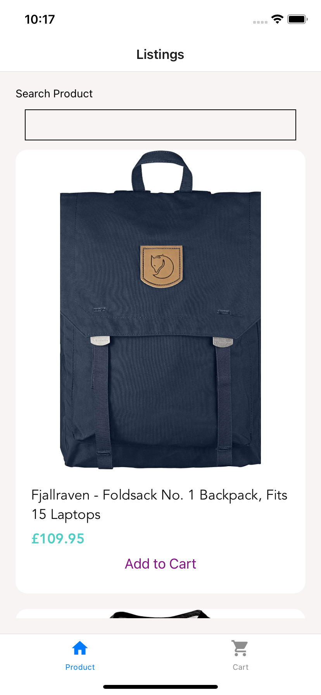

# DemoApp

Demo code for react native shopping cart
 

Install Expo Go in your phone, open following link 
https://expo.dev/@webtrackerxyz/demornapp

Tested environment:  
Mac OS: M1 Big Sur 11.4  
Nodejs: v16.11.1  
react: 17.0.2  
react native: 0.67.3  

// Functions
1. get JSON FROM hhttps://fakestoreapi.com/products
2. List the items by state
3. Search product -> filter the products by product name
3. Click the item -> Details
4. "ADD to CART" -> add to card
5. CART -> ADD / EDIT / REMOVE
6. React.Context for data storage
   -> product
   -> cart

// Navigation 

TAB -> PRODUCT / CART  
PRODUCT -> LIST -> DETAILS  
CART -> LIST -> DETAILS  

//install
1. install expo ( https://docs.expo.dev/ )
2. npm install
3. expo start -c

